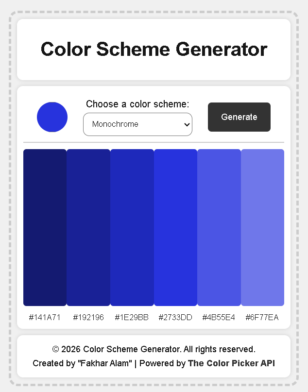
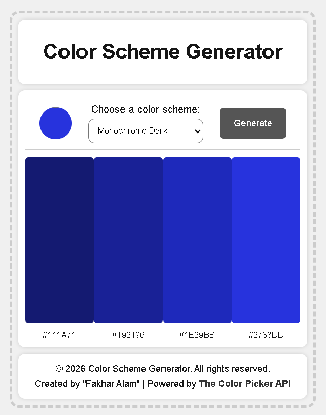
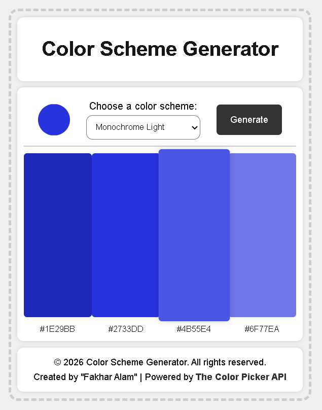
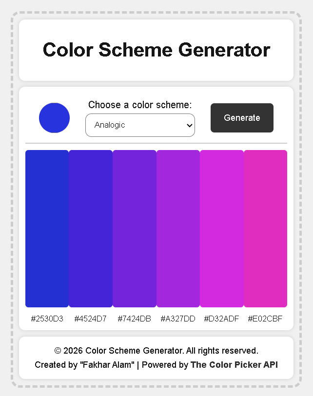
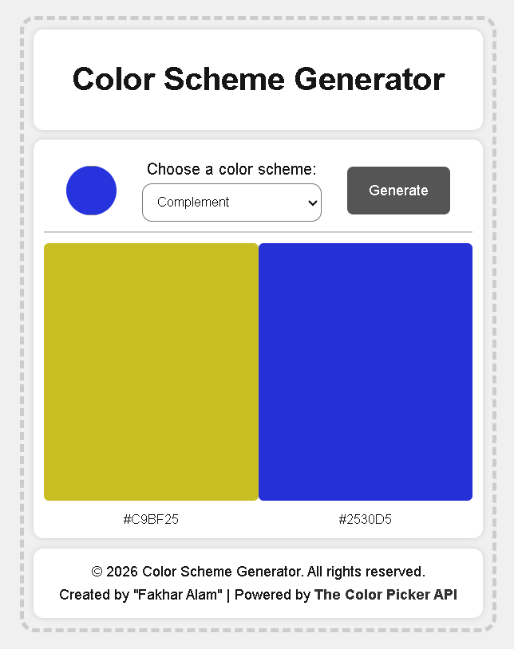
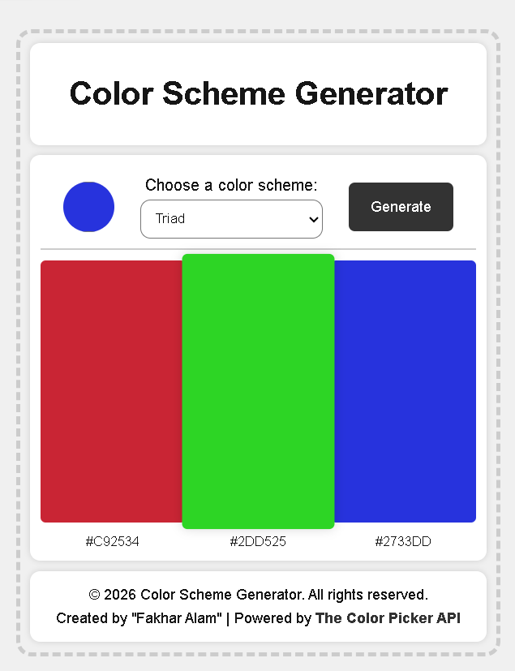
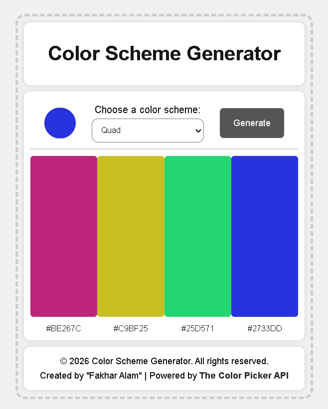

# 🎨 Color Scheme Generator

A clean and interactive **Color Scheme Generator** built with HTML, CSS, and JavaScript.  
This tool allows users to generate beautiful color palettes based on different color harmony rules.

---

## 🚀 Live Demo
👉 Not yet available

---

## ✨ Features

- 🎨 Generate color schemes using real design principles:
  - Monochrome
  - Monochrome Dark / Light
  - Analogic
  - Complement
  - Triad
  - Quad
- 🎯 Choose a base color using a circular color picker
- ⚡ Fetch real-time color palettes using **The Color API**
- 🧩 Clean and minimal UI focused on usability
- 📋 Click any color to copy its HEX value (if implemented)

---

## 🖼️ Screenshots

### 🔹 Monochrome

### 🔹 Monochrome Dark

### 🔹 Monochrome Light

### 🔹 Analogic

### 🔹 Complement

### 🔹 Triad

### 🔹 Quad

---

## 🛠️ Tech Stack

- **HTML5**
- **CSS3 (Flexbox)**
- **JavaScript (ES6)**
- **The Color API**

---

## 📁 Project Structure

color-scheme-generator/
│
├── index.html
├── index.css
├── index.js
│
├── screenshots/
│   ├── Screenshot1.png
│   ├── Screenshot2.png
│   ├── Screenshot3.png
│   ├── Screenshot4.png
│   ├── Screenshot5.png
│   ├── Screenshot6.png
│   └── Screenshot7.png
│
└── screen-recording/
    └── screen-recording.mp4

---

## ⚙️ How It Works

1. Select a **base color** using the color picker  
2. Choose a **color scheme type**  
3. Click **Generate**  
4. The app fetches a palette from the API and displays it instantly  

---

## 📦 API Used

- [The Color API](https://www.thecolorapi.com)

---

## 🎯 Learning Goals

This project helped me:

- Understand **API integration using fetch()**
- Work with **dynamic DOM rendering**
- Improve **CSS layout and UI design**
- Learn how **color theory applies in real applications**
- Build a **functional and interactive frontend tool**

---

## 🔗 Connect With Me

- 💼 LinkedIn: https://www.linkedin.com/in/fakhar-e-alam-a046133b4/  
- 🎓 Scrimba Profile: https://scrimba.com/?via=u43a7734  

> I am currently learning **Full Stack Development from Scrimba**.  
> Use my link to join this awesome course and start your journey 🚀

---

## 📌 Future Improvements

- 🎯 Add copy-to-clipboard feedback UI
- 🎨 Add custom color wheel picker
- 📱 Improve responsiveness for mobile
- 💾 Save favorite color palettes

---

## ⭐ Show Your Support

If you like this project, consider giving it a ⭐ on GitHub!

---

**© 2026 Color Scheme Generator — Created by Fakhar Alam**
